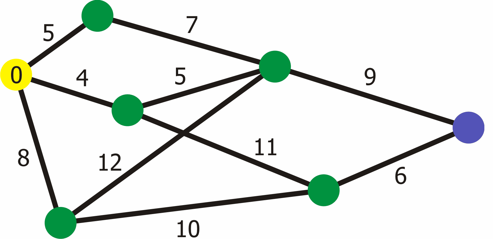

   

<h1 align="center">
     Smart Library :pushpin:  
</h1>

# Presentation :memo:
- ### **General Objectives**
  - Objective to facilitate the search for books in libraries, offering practicality in the search and displacement.
- ### **Justification**
  - Assist in the management of a library with automated processes, saving unnecessary expenses, greater organization and pleasant environment.
- ### **Expected Results**
  - The company that uses the Smart Library will have automated processes, with standardization in location, more efficient service to the reader, in addition to analyzing reader evaluations, thus having suggestions of themes and relevance of the works.
- ### **Practical Application**
  - This project will provide details on where to find books with indications of shelves, display suggestions for reading according to the related theme, check availability and deadline for return. Through a Web application, and the application of the Dijkstra Algorithm, performing the search for routes.

# Dijkstra Algorithm :rocket:

   

